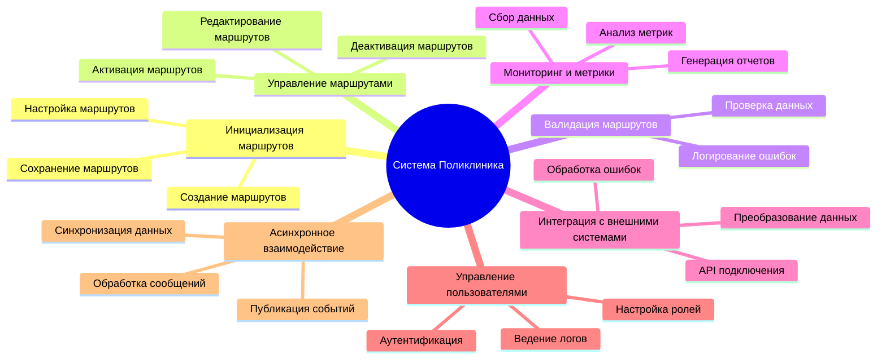
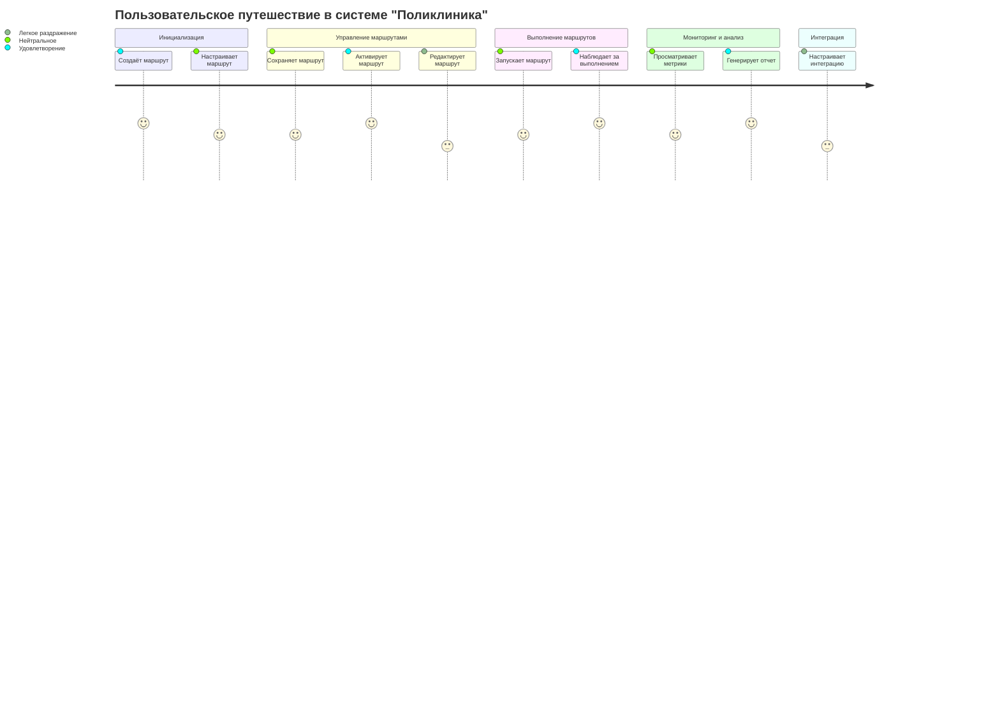
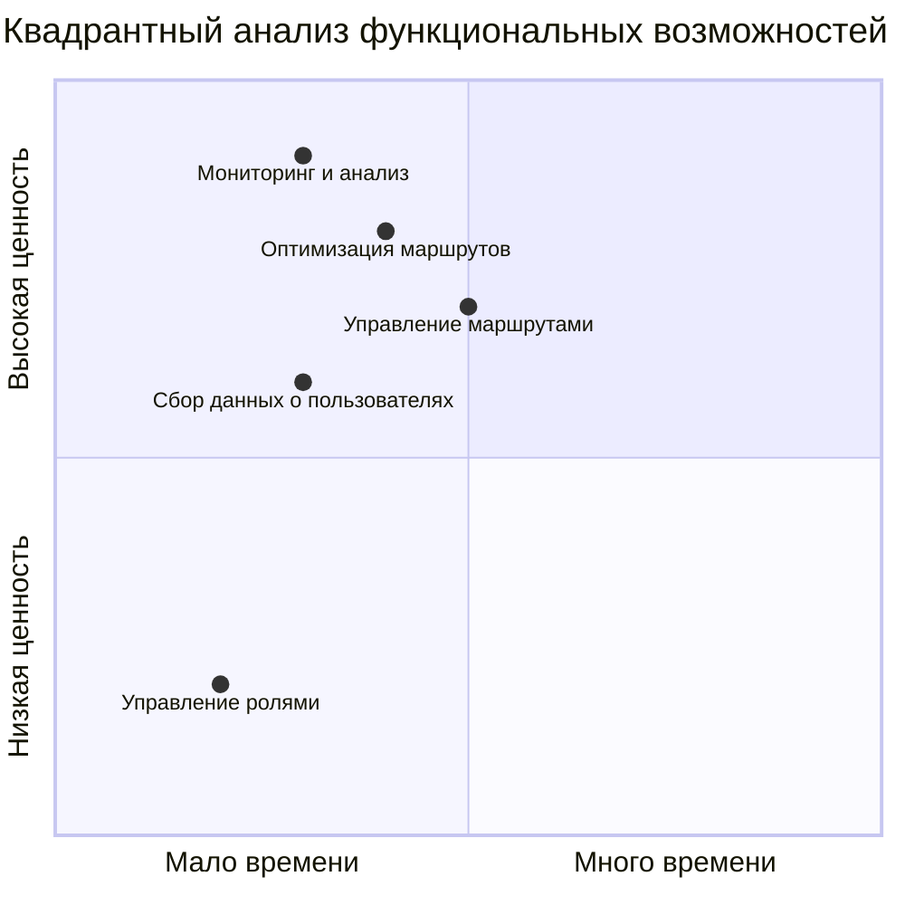
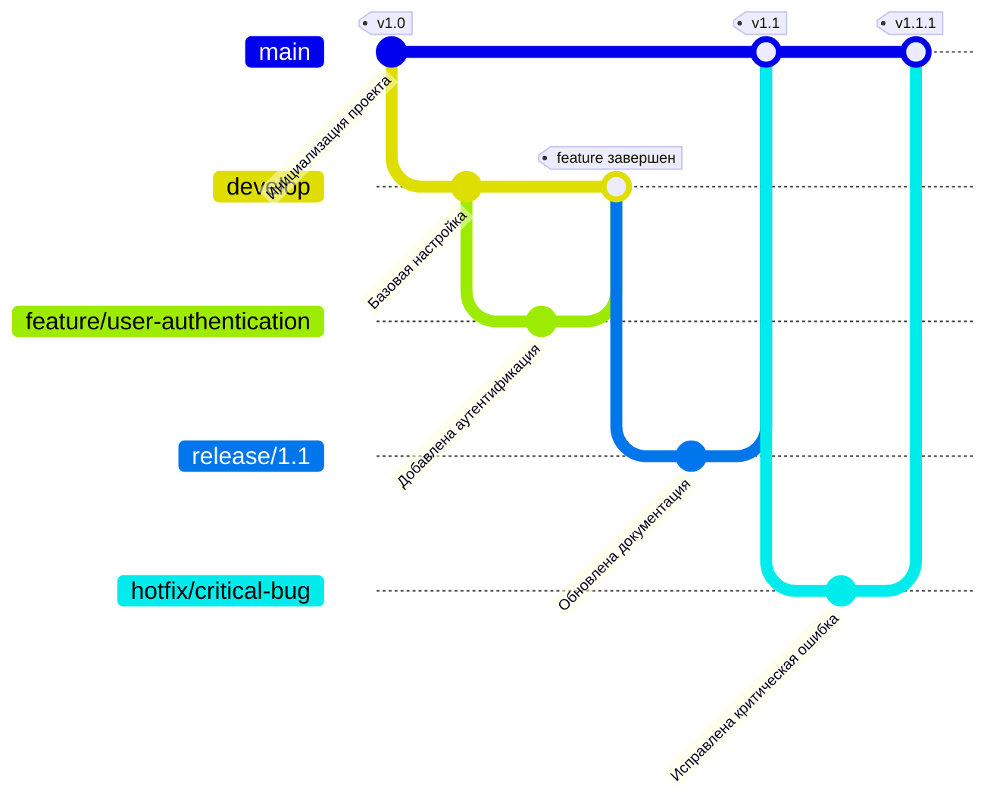

# Практическая работа № 12

## Цель практической работы
Освоить синтаксис и возможности Mermaid для создания различных типов диаграмм в документах Markdown. Научиться интегрировать диаграммы Mermaid в Markdown-документы. Применить полученные знания для визуализации структур и процессов в рамках своей индивидуальной темы проекта, используя новые типы диаграмм.

---

## Ход работы

### 1. Структура функциональных возможностей приложения (Mind Map)
В диаграмме отражены основные функции системы "Поликлиника":
- **Инициализация маршрутов** включает создание, настройку и сохранение маршрутов.
- **Управление маршрутами** охватывает активацию, деактивацию и редактирование маршрутов.
- **Валидация маршрутов** проверяет корректность шагов и данных, фиксируя ошибки.
- **Мониторинг и метрики** обеспечивают сбор данных, анализ состояния системы и генерацию отчетов.
- **Интеграция с внешними системами** включает подключение API, преобразование данных и обработку ошибок.
- **Управление пользователями** отвечает за аутентификацию, настройку ролей и ведение логов действий.
- **Асинхронное взаимодействие** обеспечивает публикацию событий, обработку сообщений и синхронизацию данных.

---

### 2. Диаграмма путешествия пользователя (User Journey Map)
Диаграмма пользовательского путешествия отражает ключевые этапы взаимодействия пользователя с системой "Поликлиника".

---

### 3. Квадрантный анализ функциональных возможностей системы
Диаграмма анализирует функции системы по двум критериям: **время, затраченное на реализацию**, и **ценность для бизнеса**.

---

### 4. Git-граф
Git-граф демонстрирует процесс разработки с использованием стратегии ветвления Git-Flow.

---

## Заключение
В ходе работы были разработаны диаграммы с использованием Mermaid, включая Mind Map, User Journey Map, квадрантный анализ и Git-граф. Эти инструменты позволили визуализировать ключевые аспекты и процессы системы "Поликлиника". Диаграммы обеспечивают понятное представление функционала и этапов разработки системы, что является важным шагом для структурирования архитектурных решений.
