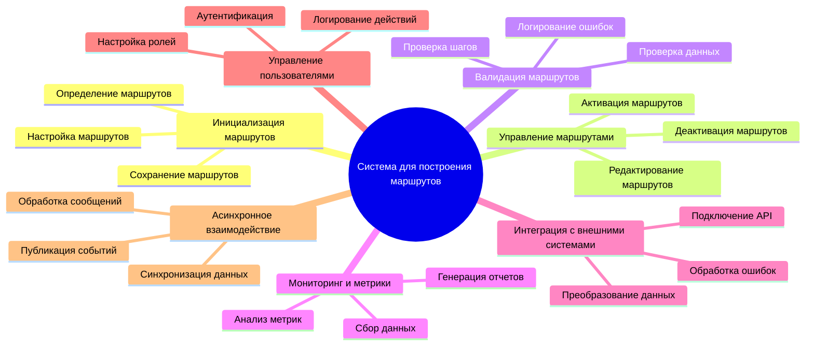
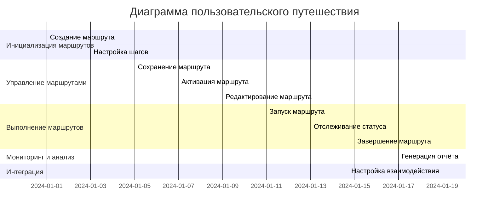
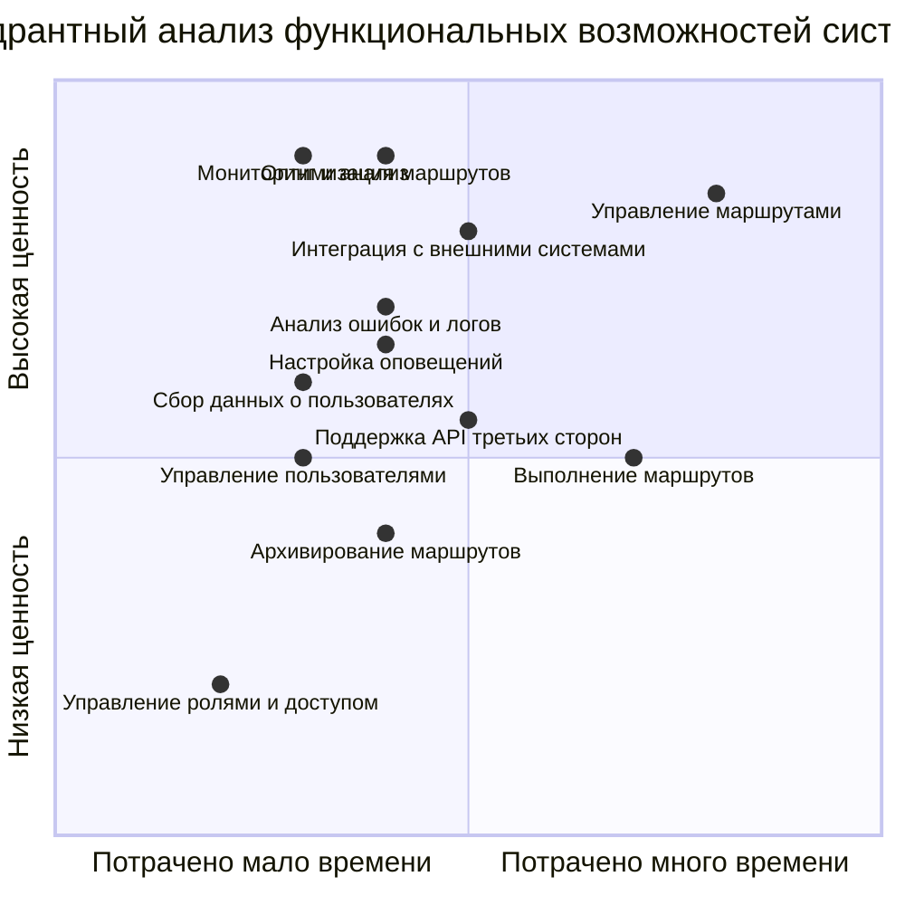
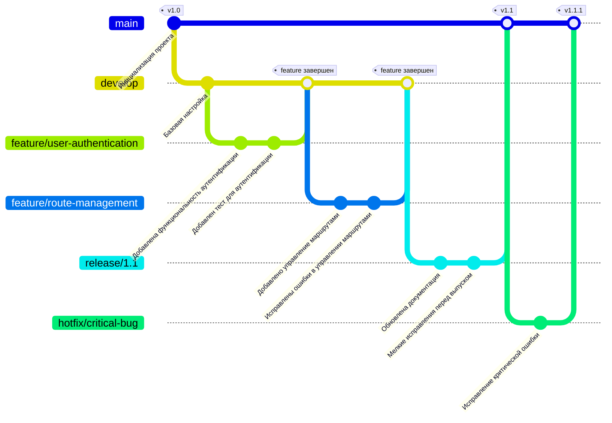

# Практическая работа № 12

## Цель практической работы

Освоить синтаксис и возможности Mermaid для создания различных типов диаграмм в документах Markdown. Научиться интегрировать диаграммы Mermaid в Markdown-документы. Применить полученные знания для визуализации структур и процессов в рамках своей индивидуальной темы проекта, используя новые типы диаграмм.

## Ход работы

### 1. Структура функциональных возможностей приложения (Mindmap)

Диаграмма отображает основные функции системы "Поликлиника":
- **Инициализация маршрутов** включает создание, настройку и сохранение маршрутов.
- **Управление маршрутами** охватывает активацию, деактивацию и редактирование маршрутов.
- **Валидация маршрутов** проверяет корректность шагов и данных, фиксируя ошибки.
- **Мониторинг и метрики** обеспечивают сбор данных, анализ состояния системы и генерацию отчетов.
- **Интеграция с внешними системами** включает подключение API, преобразование данных и обработку ошибок.
- **Управление пользователями** отвечает за аутентификацию, настройку ролей и ведение логов действий.
- **Асинхронное взаимодействие** обеспечивает публикацию событий, обработку сообщений и синхронизацию данных.

Эта структура систематизирует функциональные возможности для эффективной работы и масштабирования.

### 2. Диаграмма путешествия пользователя (User Journey Map)

Диаграмма пользовательского путешествия отражает ключевые этапы взаимодействия пользователя с системой "Поликлиника":
- **Инициализация маршрутов**: создание маршрута, добавление шагов и их настройка.
- **Управление маршрутами**: сохранение, активация и редактирование маршрутов.
- **Выполнение маршрутов**: запуск маршрута, отслеживание его статуса через мониторинг системы и получение уведомлений о завершении.
- **Мониторинг и анализ**: просмотр метрик, генерация отчётов и принятие решений для оптимизации маршрутов.
- **Интеграция**: настройка взаимодействия с внешними системами и синхронизация данных для обеспечения корректной работы всей системы.

### 3. Квадрант-граф

Квадрант-граф анализирует функциональные возможности системы, оценивая их по двум критериям: время, затраченное на реализацию (по горизонтали), и ценность для бизнеса и пользователей (по вертикали).
- **Высокая ценность, малое время**: приоритетные функции, такие как "Мониторинг и анализ" и "Оптимизация маршрутов".
- **Средняя ценность**: функции с умеренными затратами, например, "Сбор данных о пользователях" и "Настройка оповещений".
- **Низкая ценность**: функции, которые можно отложить, например, "Архивирование маршрутов".

### 4. Git-граф

Git-граф демонстрирует процесс разработки системы "Поликлиника" с использованием стратегии ветвления Git-Flow:
- **main** содержит стабильные версии проекта.
- **develop** используется для интеграции новых функций и тестирования.
- Каждая новая функциональность разрабатывается в отдельных feature-ветках.
- Перед выпуском создаётся release-ветка для финального тестирования.
- Критические ошибки исправляются в hotfix-ветках, которые вливаются в main и develop.

---

## Заключение

В ходе работы освоен синтаксис Mermaid для построения диаграмм в Markdown. Были реализованы mindmap, user journey map, quadrant chart и git-graph. Диаграммы визуализируют ключевые аспекты разработки системы "Поликлиника", включая функциональные возможности, этапы взаимодействия пользователя и стратегию ветвления Git.
